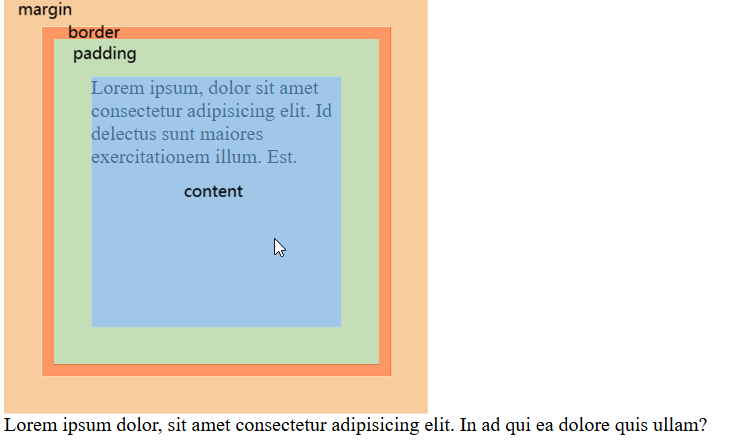

# Box Model

## Introduction



## Properties

### 1. Width & Height

- Values:
  1. `<length>`: px, em, rem, vh, vw etc.
  2. `<percent>`: relative to the element's containing block width (content area of parent)

> In development, pc site usually uses px, % mainly for mobile site, or responsive site


### 2. Border

1. Shorthand for all sides

border

2. Side-Specific Shorthands

- border-top
- border-right
- border-bottom
- border-left

3. Property-Specific Shorthands

- border-width
- border-style
- border-color

4. Specific Properties

- border-top-width
- border-top-style
- border-top-color
- border-right-width
- border-right-style
- border-right-color
- border-bottom-width
- border-bottom-style
- border-bottom-color
- border-left-width
- border-left-style
- border-left-color

```css
.box {
  /* border: border-width border-style border-color  */
  border: 1px dotted red;

  /* Remove border */
  /* border: none; */
}
```

### 3. Padding

1. Shorthand:
   1. One value: for four side
   2. Two value: top-bottom left-right
   3. Three value: top left-right bottom
   4. Four value: top right bottom left (clockwise)
2. Side-specific Propeties:
   1. padding-top
   2. padding-right
   3. padding-bottom
   4. padding-left


### 4. Margin

- Space around box, outside of defined border.
- Values:
    - `margin-top`
    - `margin-right`
    - `margin-bottom`
    - `margin-left`
  
#### Horizontal Centering of Block Boxes
  ```css
  /* set margin-left & margin-right to be auto. */
  margin: 0 auto;
  ```
> - vertical centering is not possible.
> - text & img vertical centering: `text-align:center`

#### Margin Collapsing

Margin collapsing: elements' top and bottom margins are sometimes collapsed / combined into one.

1. **Between Adjacent Siblings, Vertical Direction**

The `margin bottom of block A` and the `margin top of block B` are combined / collapsed into a single margin.
- If block A margin bottom > block B margin top, take the largest (value of block A margin bottom.)
- If both margins are equal in size, take one.

> Solutions:
> 1. Add `display: inline-block` to one of the sibling boxes (Related to BFC, choose if you don't mind the type of box will change).
> 2. Add total margin to one of the sibling boxes (Easiest, but it may not work with third party component). 
> 3. Change margin of one element to padding (This solution is suitable for boxes without background color)
> 

1. **Between Parent and Child, Vertical Direction**

The `margin-top of parent` and `margin-top of child` are collapsed into a single margin.
- The child margin penetrates through the parent top edge.
- If the margin-top of child > margin-top of parent, margin-top of child takes precedence.

> Solutions:
> 1. Add `overflow: hidden` to parent. (related to BFC, make sure the content is not exceeding the box, as it will be hidden.)
> 2. Add a `transparent border` to parent. (border takes some space, the border must be included in measurement)
> 3. Remove margin-top from child element, add padding-top to parent (parent height may increase)

### 5. Removing Default Element Styles

Examples:
- body, h1~h6, ul, p, dl, dd tags all have default margin
- ul has default padding and list-style
- a tags have default color and underline
- etc.

> Use "CSS Reset" or "CSS Normalization"

### 6. Box Model Dimension Calculations

- Most HTML element use Content Box Model (default box-sizing)
- **Content area** = width & height
- **Visible width** = width + left & right padding + left & right border
- **Visible height** = height + top & bottom padding + top & bottom border
- **Total width** = visible width + left & right margin
- **Total height** = visible height + top & bottom margin

> - The size of content area decides the max width and height the child elements can occupy (total width and total height of the child).
> - Overflow will occur if child's total size > parent's content size
> - Child elements will wrap to a new row only if they are inline/inline-block elements, or using float, flexbox, etc if sum of child elements' total widths > parent's content width

## Box-sizing

- Set how total width and height is calculated.
- Values:
  - `content-box`
  - `border-box` (IE box)
- Content box:
  - width = content width
  - heigth = content height
- Border box:
  - width = content width + padding + border
  - height = content height + padding + border
  - content width = width - padding - border
  - content height = height - border - padding
  - e.g., `<button>` uses border-box by default 

> **Applications**:
> 1. Responsive design / mobile site development.
> 2. Maintaining consistent visible dimensions (No manual calculation needed)
> Note: if margin presents, do consider subtract margin on our own.

```css
/* Content box requires us to calculate how much size the child element can fit in the content area of parent element */
/* item total size */
/* total size = 300 = size + padding +  border */
/* total size = 300 = x + (2*5) + (2*2) */
/* x = 300 - 14 = 286px */
/* In this case, we can use border-box, so we don't need to calculate. */
/*
.item {
  width: 286px;
  height: 286px;
  border: 2px solid blue;
  padding: 5px;
} */

.item {
  box-sizing: border-box;
  /* The benefit of border box is that we no longer need to calculate width and height of child element manually! */
  /* The calculation is done for us automatically. */
  /* Assume margin = 0. */
  /* Note: if margin presents, we need to subtract the margin. */
  width: 300px; /* Visible width = content width + padding + border */
  height: 300px; /* Visible height = content height + padding + border */
  border: 2px solid blue;
  padding: 5px;
}
```


## Display

- Set the type of box (inline / block) and the layout the box will participate
- Specify the outer display type and inner display type.
  - Outer display type: the role of element in the layout (inline / block)
  - Inner display type: the layout of children (flow, flow-root, flex, grid, table etc.)
- Common Use Value:
  - `block`
  - `inline`
  - `inline-block`
  - `flex`
  - `grid`
  - `none`: do not display. The element and its children do not display on the page, as if they didn`t exist.

```css
div {
  /* Single keywords - Precomposed */
  /* display: block; */
  /* display: inline; */
  /* display: flex; */
  /* display: grid; */
  /* display: inline-block; */
  /* display: inline-flex; */
  /* display: inline-grid; */

  /* Multiple keywords: <display-outside> <display-inside>*/
  /* display: inline flow-root;  */
  /* display: inline flex; */
  /* display: inline grid; */

  /* Other keywords: */
  /* display: table; */
  /* display: list-item; */
  /* etc. */
  
}
```

**Display: none vs Visibility: hidden**

| Difference            | Display: none                                                        | Visibility: hidden                                                                    |
| --------------------- | -------------------------------------------------------------------- | ------------------------------------------------------------------------------------- |
| Occupies Space        | no (Element removed from layout)                                     | yes (space preserved, invisible but present)                                          |
| Reflow (Layout Shift) | yes (layout has shifted)                                             | no  (space preserved)                                                                 |
| Repaint               | yes                                                                  | yes                                                                                   |
| Affect Child          | Do not display children, there's no way to make child display again. | Hide all children, but adding `visibility: visible` to children can make them visible |


**Understanding block box:**

> e.g., `<div>`, `<h1>`, `<p>`, etc.

1. Block elements stack vertically
2. Width and height can be set
  - If width is not set, defaults to 100% of parent's content area width
  - If height is not set, expands to fit content (follows the children)
3. Respects all box model properties (margin, padding, border)
4. Vertical margin collapse
5. Gap between siblings decided by margin
6. Any elements can be put inside block elemnet.
  - **Exception**: text related element cannot have other block elements as children.
   - `<p>` element cannot have `<p>` and `<div>`.
   - `<h1>` - `<h6>` element cannot have `<p>` and `<div>`. 

**Understanding inline box:**

> e.g., `<span>`, `<strong>`, `<i>`, etc.

1. Inline elements flow horizontally (on the same row)
2. Width/height are ignored - adjust size using `font-size`, `line-height`, `padding`, `font-family`, etc. 
3. Only horizontal margin/padding affect layout; vertical margin ignored, vertical padding/border visible but don't affect flow
4. Wraps to next line when container width exceeded
5. Use `vertical align` to align the inline element vertically.
6. Use `text-align` on parent to align the inline elements inside the parent horizontally.
7. Inline element may contain text or other inline level element (Inline-block element is not recommened although it is valid).
  - **Exception**: 
    - `<a>` element cannot put another `<a>` element as child.
    - `<a>` element allows block element.

**Best Practice:**
1. Convert `<a>` element to block element.
2. Do not use `<span>` to wrap replaced element.
3. Do not use `<span>` to wrap other block element.


**Understanding inline-block box:**

- Combination of block box and inline box.
- Like block boxes, width, height, padding, margin and border can be set.
- Like inline boxes, inline-block box flows horizontally (on the same row)
- Inline-block element may contain text or other inline-level element (block box is not recommended even though it is valid).

> Note: some replaced elements like `` behave like inline-block box but they are actually inline box. 


**Problem with inline-level boxes (inline box & inline-block box)**
- White space collapsing causes gap between these inline-level boxes.
- White spaces / new lines collapses into a single space.
- Solutions:
  1. Set parent font-size to 0, set children font-size back to default font-size.
  2. Use float on individual children and clear float on parent.
     1. clear floats using BFC e.g., set `overflow:hidden` on parent
     2. define a clearfix class using pseudo element `::after`
     ```css
      .clearfix::after {
        content:"";
        display:block;
        clear:both;
      }

     ``` 

> For img element, we can use the aforementioned method to deal with the whitespace issue.
> Best practice: set img element as block element.