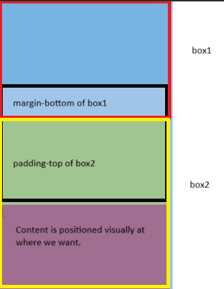

# Box Model

## Introduction

## Properties

### 1. Width & Height

### 2. Border

### 3. Padding

### 4. Margin

- space around box, outside of defined border.
- values:
    - `margin-top`
    - `margin-right`
    - `margin-bottom`
    - `margin-left`
  
#### Horizontal Centering of Block Boxes
  ```css
  /* set margin-left & margin-right to be auto. */
  margin: 0 auto;
  ```
> vertical centering is not possible.
> text & img vertical centering: `text-align:center`

#### Margin Collapsing

Margin collapsing: elements' top and bottom margins are sometimes collapsed / combined into one.

1. **Between Adjacent Siblings, Vertical Direction: Collapse of Top and Bottom Margins**

The margin bottom of block A and the margin top of block B are combined / collapsed into a single margin.
- if block A margin bottom > block B margin top, take the largest (value of block A margin bottom.)
- if both margins are equal in size, take one.

> Solutions:
> 1. add `display: inline-block` to one of the sibling boxes (Choose other method if we dont want to change the type of box.).
> 2. add margin to only one of the sibling boxes (Easiest, but it may not work with third party component). 
> 3. change one of the margin to padding -> the box might seems weird, but the content box is located visually at what we want it to be.
> 

2. **Between Parent and Child, Vertical Direction**

The margin-top of parent and margin-top of child are collapsed into a single margin.
- The child margin penetrates through the parent top edge.
- If the margin-top of child > margin-top of parent, margin-top of child takes precedence.

> Solutions:
> 1. Add overflow: hidden to parent. (Make sure the content is not exceeding the box) - Why? Related to BFC.
> 2. Add a transparent border to parent. (border takes some space.)
> 3. Change margin-top of child to padding-top.
> 4. Add a padding-top equivalent to the value of margin-top of child to parent. (It causes the parent height to increase.)

Each solution has their side effects. Use with cautions.
### 5. Remove Default Properties.

### 6. Occupied Space Calculation

## Box-sizing

## Display

### 1. Usage

### 2. Explicity Display Types

### 3. Conversion of Display Types

### 4. Hiding Element