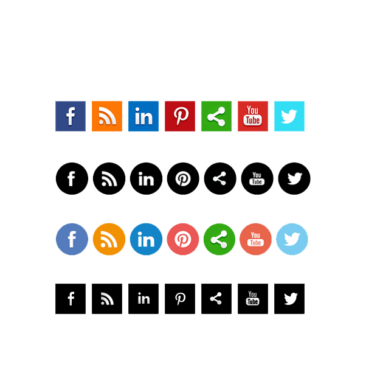

# Background

## 1. background-color

- Set the background color of an element.
- Values:
  1. Keyword
  2. RGB
  3. HEX
  4. HSL

> Note: 
> - New Syntaxes for some color functions:
> - Note: Legacy form is still supported.
> 1. rgb(r, g, b) -> rgb(r g b / alpha)
> 2. hex(#rrggbb) -> hex(#rrggbbaa)
> 3. hsl(h, s%, l%, alpha) -> hsl(h s% l% / a%)


## 2. background-image

- Set one or more background images on an element.
- Note: If the topmost background image layer is not transparent, it will visually cover the layers beneath it.

### i. url(path)

- Includes a file.
- path: 
  - absolute path
  - relative path
  - data url
  - etc.

Note: url() function can be a value for many properties:
    1. background
    2. background-image
    3. border-image
    4. cursor
    5. filter
    6. list-style-image
    7. clip-path
    8. src of @font-face
    9.  etc.

### ii. Gradient Functions

#### a. linear-gradient

- Create an image of gradient between two or more colors along a straight line.

```css
.box {
  /* linear-gradient(direction, color-stop, ..., color-stop) */
  
  /* Direction options:
     - angle: 0deg, 45deg, 90deg, etc.
       • 0deg = bottom to top
       • 90deg = left to right
       • 180deg = top to bottom
       • 270deg = right to left
     - keyword: to top, to bottom, to left, to right, to top right, etc.
  */
  
  /* Color stops:
     - color with optional position (percentage or length)
     - if position omitted, colors are evenly distributed
  */
  
  /* Color hints: standalone percentage/angle between color stops
     - do not define a color 
     - controls transition midpoint between adjacent colors
     - if omitted, defaults to midpoint
  */
  
  background-image: linear-gradient(
    45deg,
    red 45%,
    60%, /* color hint */
    yellow 70%,
    blue
  );
  /* background-image: linear-gradient(to left top, red 45%, yellow 70%, blue); */
}

```
#### b. radial-gradient

- Create an image of gradient between two or more colors radiating from an origin.


```css
.box {
  /* radial-gradient([shape size] at position, color-stop, ..., color-stop) */
  
  /* Shape: circle | ellipse (default) */
  
  /* Size options:
     - keywords: closest-side, closest-corner, farthest-side, farthest-corner (default)
     - explicit values:
       • circle: single radius value (e.g., 100px)
       • ellipse: two values for horizontal and vertical radii (e.g., 50% 100px)
  */
  
  /* Position: similar to background-position (e.g., center, top left, 50% 50%) */
  
  /* Color stops: color with optional position (percentage or length from center) */

  /* Color hints: standalone percentage/angle between color stops
     - do not define a color 
     - controls transition midpoint between adjacent colors
     - if omitted, defaults to midpoint
  */
  
  background-image: radial-gradient(
    circle closest-side at center,
    red 50%,
    80%,  /* color hint */
    yellow 100%,
    transparent
  );
}

```

#### c. conic-gradient

- Create an image of gradient between two or more colors rotating around a center point.


```css
.box {
  /* conic-gradient([from angle] [at position], color-stop, ..., color-stop) */
  
  /* Starting angle: 0deg (default = top), can use deg, rad, turn, grad */
  
  /* Position: similar to background-position (default = center) */
  
  /* Color stops:
     - angle values (deg, turn, etc.) or percentage (of 360deg)
     - 0% = 0deg, 50% = 180deg, 100% = 360deg
  */
  
  /* Color hints: standalone percentage/angle between color stops
     - do not define a color 
     - controls transition midpoint between adjacent colors
     - if omitted, defaults to midpoint
  */
  
  background-image: conic-gradient(
    from 45deg at center,
    red 30%,
    yellow 60%,
    65%,  /* color hint */
    green 80%
  );
}

```
#### Creating Hard Edges (No gradient transition)
- Places two color stops at the same position
- Apply to all gradient function
- Aliasing issues may occur, add 1px overlap to make it less obvious

```css
.box {
  /* Hard edge technique: adjacent colors share the same position */
  
  /* Linear gradient with hard edges */
  background-image: linear-gradient(
    90deg,
    red 33.33%,
    yellow 33.33%,  /* hard edge: yellow starts where red ends */
    yellow 66.66%,
    blue 66.66%     /* hard edge: blue starts where yellow ends */
  );
}
```

## 3. background-repeat

- Specify how background images are repeated.
- Values:
    - repeat (Default)
    - repeat-x
    - repeat-y
    - no-repeat(Commonly used)
    - round
    - space

## 4. background-position

- Set the initial position for each background image.
- Keywords: `center`, `left`, `right`, `top`, `bottom`
- Values can be `<length>` or `<percentage>`
- Syntaxes:
  1. One-value syntax 
    - `background-position: keyword;`
    - `background-position: value;`
  2. Two-value syntax 
    - `background-position: keywordX keywordY` or `background-position: keywordY keywordX` (Order is not important)
    - `background-position: x y;` (Order is important)
  3. Three-value syntax 
    - `background-position: keywordX offsetX keywordY` or `background-position: keywordY offsetY keywordX`
  4. Four-value syntax 
    - `background-position: keywordX offsetX keywordY offsetY;` or `background-position: keywordY offsetY keywordX offsetX;`

**Percentage converts to offset:**
- offset = (container - image) * percentage

**Longhand Properties:**
1. `background-position-x`
2. `background-position-y`


## 5. background-size

- Set the background image size.
- Keywords: 
  - `contain`: show the whole img, no cropping allowed. (Aspect ratio is preserved)
  - `cover`: fill the entire container, no empty space allowed, even if it means the image is getting cropped. (Aspect ratio is preserved)
- Values can be 
  - default: `auto auto`
  - `<length>`
  - `<percentage>`: relative to the container size
  - `auto`: use the image’s intrinsic size; when paired with another value, the image scales and the aspect ratio is preserved.
- Syntaxes:
  - One-value: 
    - `background-size: keyword;`
    - `background-size: width;` (Note: height is `auto` )
  - Two-values:
    - `background-size: width height;`
    - Note: when both values are not auto, the image may be stretched and the aspect ratio can be distorted.

## 6. background-attachment

- Set whether a background image's position is fixed within the viewport, or scrolls with its containing block.
- Values:
  - `scroll`: default, stick to element and scroll with it.
  - `fixed`: stick to viewport, the page content moves, but the background does not move as we scroll the page
  - `local`: stick to content, background-image moves as the content scrolls.

> **Note**: 
> - background-attachment has some effect on `background-size: cover;`.
>   - `background-attachment: fixed;`: the image is like painted to the viewport and the image is scaled to cover the viewport.
  ```css
  .box {
    background-attachment: fixed;
    background-size: cover;
  }
  ```
> - `background-attachment: local;`: the image is like painted to the element content and the image is scaled to cover the content.

## 7. background-clip

- Set whether an element's background extends underneath its border box, padding box, or content box.
- Simply, controls WHERE the painted background is allowed to be visible.
- Values:
  - `padding-box`
  - `border-box`
  - `content-box`
  - `text`

## 8. background-origin

- Set the background origin.
- Simply, controls WHERE the background image starts painting.
- Values:
  - `padding-box`
  - `border-box`
  - `content-box`

## 9. background shorthand

- Recommended order: `background: <bg-image> <bg-position> / <bg-size> <repeat-style> <attachment> <bg-clip> <bg-origin> <'background-color'>;`
- Note: none of the values are required. If any of the properties are not written, the browser will use the default value.

**Best Practice:**
1. Use shorthand first, then longhand to override specific values.

## 10. Image Sprites Technique



- Image Sprites is a technique combining multiple small images / icons into a single image file called Sprite Sheet.
- Use `background-position` to locate the exact icon that we need.
- Image Sprites are not used a lot nowadays.
- Modern alternative: svg, icon font libraries