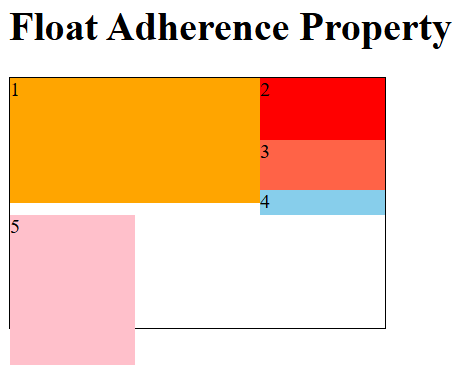
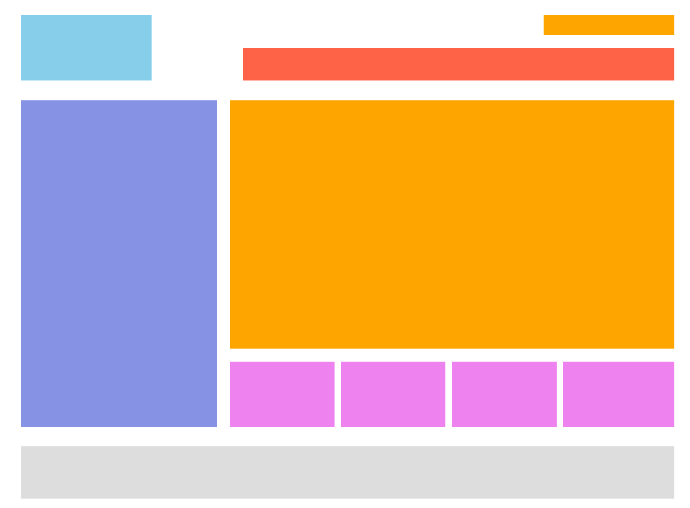

# Float & BFC

## Introduction to CSS Layout

- how we lay out the boxes in relation to one another and the viewport.

- layout methods:
  - Normal Layout Flow (From top to bottom, left to right)
  - Float Layout
  - Positioned Layout
  - Table
  - Multi-column Layout
  - Flex
  - Grid
  - Responsive Design (E.g., the fundamental of Bootstap).

## Normal Flow Layout

- Default layout method in HTML when we haven't applied any CSS that changes how it behave..
- specify the arrangement of block-level elements and inline elements.

> all HTML elements are boxes based on the Box Model.
> Aligning block-level elements in a line is impossible in the Normal Flow Layout.
> Using float layout, we can do it.

### 1. The Arrangement of Block-Level Elements 

- block-level elements will be aligned vertically starting at the top edge of the containing block (content area of the parent)
- The vertical distance between two elements will be determined by margins.
- Margin collapsing rule applies to the vertical distance between two adjacent block-level boxes.

### 2. The Arrangement of Block-Level Elements 

- inline elements will be aligned horizontally starting at the top edge of the containing block.
- setting margin (except margin-top & margin-bottom), padding and border is working.
- there are several methods to align inline boxes vertically in a line, such as aligning them to the top, bottom, middle, the baseline of text.

## Float Layout

### 1. Origin Of Float

- Originally, it is introduced to create simple layouts like floating images with wrap-around texts.
- Later, its usage and application has been broadened and almost every box can be floated.

### 2. How float works?
[In Flow & Out of Flow](https://developer.mozilla.org/en-US/docs/Web/CSS/CSS_display/In_flow_and_out_of_flow)
- The element with the `float` set is partially `out of flow` and shift to either `left` or `right`.
  - float no longer in the default block / inline layout.
  - block-level siblings ignores their presence as if they are not there.
  - inline contents wraps around them.

> Note: Block-formatting context (BFC) will contain floated elements.

> Note: In later chapter we will learn about `position: absolute / fixed` where the element will be fully taken out of document flow and their presence is ignored by both block & inline content.

### 3. Key Points of Using Float

- implement side-by-side arrangement of block-level elements.
- enough space of the containing block to accomondate float elements.
- Importance: Each element we want to arrange side by side must set `float`.

### 4. How to Create Floated Elemnt?

- set `float` property.

- value:
  - `none`: must not float.
  - `left`: float on the left side.
  - `right`: float on the right side.
  - `inherit`: inherit from parent's float value. (Rarely use.)

### 5. Features of Floated Elements

1. Floated element is out of flow.

- it will affect elements behind it, while the element in front of the floated element remains unaffected.

2. Floated Elements will wrap to the next line when the parent element does not have enough width.


3. Float positioning behaviours
- [How floated elements are positioned](https://developer.mozilla.org/en-US/docs/Web/CSS/float?utm_source=chatgpt.com#how_floated_elements_are_positioned)
- left-floated element aligns upwards and towards the left.
- right-floated element aligns upwards and towards the right.
- the top edge of the floated element will be **at most** the same level as the top edge of the previous floated element. (Look at 1, 2 & 3)
- when there's not enough space, the floated element will drop down to the next available line.
- When a floated element drops to the next line, its top edge cannot exceed the bottom edge of the previous floated element. (look at 4 & 5)



4. Floated element shows inline-block box properties.
- floated elements that is out of flow no longer differentiate block-level / inline-level elements.
- setting size (width & height) is allowed, even if it is just a span or a element.

5. Floated elements causes the height collapsing of parent.

6. How floated elements affects text?


7. Implement webpage layout with float.

- only set float on elements that aligned side by side.
- each box is an independent entity and container, within each box is a small world where floating can still be used.



## Box Formatting Context (BFC)

### 1. Create BFC

1. float left / right.
2. position absolute & fixed.
3. display inline-block, flex, inline-flex.
4. overflow hidden (a good way to create BFC, do not change the box layout method.)

### 2. Usage of BFC

1. contains internal floats (Avoid height collapsing)
2. excludes external floats
3. suppress margin collapsing 

### 3. Difference in Browsers

- IE6, 7 uses `haslayout` mechanism so there's difference in BFC specification.
  - e.g., IE browsers can use zoon: 1 property to make a box having layout.
- To build a webpage compatible with IE6 / 7, make the layout simpler, set height to floated elements.

> Note: Now, Microsoft already shifts to Edge.

## Clearing Float

> floated elements must be contained within a box, so it will not affect the elements behind.

### Method 1

- Create BFC for the parent of floated elements to contain internal floats.
- `overflow: hidden` is the best way.

### Method 2 (Not Recommended)

> look into [clear](https://developer.mozilla.org/en-US/docs/Web/CSS/clear) for more information.

- add `clear: both` to parent.
- `clear` removes the effect of float on itself (The parent height will not collapse, while the floated element in it still).
- `both` means clearing left and right floats.
> official: the element is moved down to clear past both left and right floats.

### Method 3 (Best)
- use `::after` pseudo element to add a child element at the back.
- add `clear: both` to `::after`

```css
.clearfix::after {
  content: "";
  /* Make it a block element */
  display: block;
  /* Clear both left and right floats. */
  clear: both;
}
```

### Method 4 (Not Recommended)
- add a box with `clearfix: both` between two parents

> Not practical to add an extra box just to clear floats.
## Application
