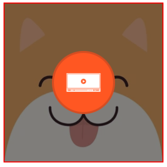
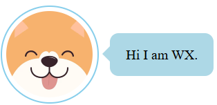
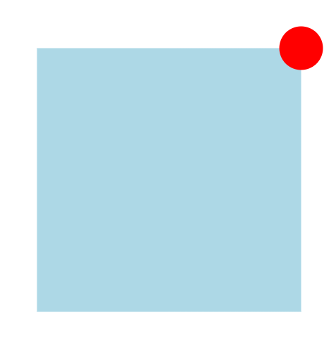
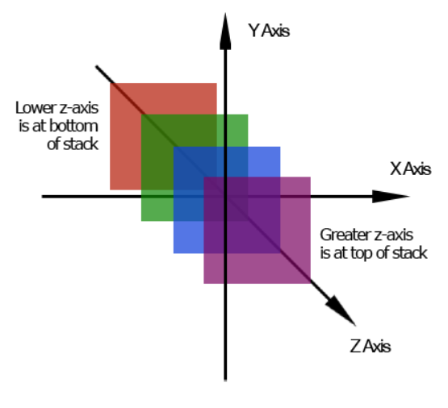
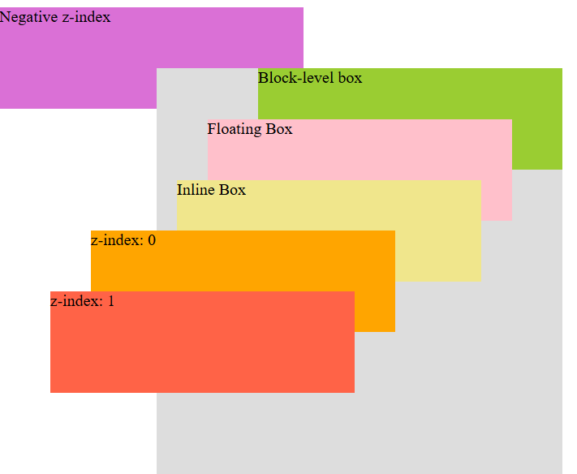

# CSS Positioning & Stacking Context

property: `position` sets how an element is positioned in a document.

| Prop     | Description                                                                                                                                      |
| -------- | ------------------------------------------------------------------------------------------------------------------------------------------------ |
| static   | positioned according to the normal document flow. (default)                                                                                      |
| relative | same as static but is offset relative to itself based on the values of `top`, `right`, `bottom`, and `left`.                                     |
| absolute | remove from document flow and is positioned relative to the nearest positioned ancestor or the initial containing block (the whole webpage html) |
| fixed    | remove from the document flow and is positioned relative to the initial containing block (html).                                                 |
| sticky   | based on the document flow and is positioned relative to the nearest scrolling ancestor (body) and nearest block-level ancestor.                 |


## 1. Relative

- values:
    - top: specify the distance between the top edge (count margin in) of the element and the inner border of the top edge of its containing block (in  this case, itself).
    - left: for left edge.
    - bottom: for bottom edge.
    - right: for right edge.

- value can be negative.

## 2. Absolute (Out of Normal Flow)

> Identify cotaning block: https://developer.mozilla.org/en-US/docs/Web/CSS/CSS_display/Containing_block#identifying_the_containing_block

### Seven features:
- a. get out of the document flow.
- b. positioned relative to the containing block (**padding box**) of the closest positioned ancestor (relative, absolute, fixed, sticky...) to the element.
- c. when parent element and ancestor element do not have position set, the current element will be placed relative to the body element.
- d. Set position on inline box makes them to behave like inline-block box, supporting setting size (width and height).
- e. `margin: 0 auto` horizontal centering is not working.
- f. Set `top`, `bottom`, `right` and `left` simultaneously to adjust element size when the element size is not yet set.
- g. Precedence of top, bottom, left and right when the size of current element is set.
  - `top` and `left` will work, `bottom` and `right` will not work.
  - and vice versa.

Note: It's possible to have absolute positioned element inside absolute positioned element.

### Applications

- create cover, overlay effect.
- work with JS to implement animation.
- etc...

#### 1. Centering

```css
/* Horizontal Centering */
left: 50%;
/* Move half of its wito the left by 50px */
margin-left: -50px;

/* Vertical Centering */
top: 50%;
/* Move half of its heito the top by 50px */
margin-top: -50px;


/* Alternative: auto means absorbing the remaining space left. */

/* Horizontal Centering */
left: 0;
right: 0;
margin: 0 auto;

/* Vertical Centering */
top: 0;
bottom: 0;
margin: auto 0;

/* Centering both horizontally and vertically */
top: 0;
bottom: 0;
left: 0;
right: 0;
margin: auto;


```

#### 2. Overlay Effect


#### 3. Implement Chatbox


## 3. Fixed (Out of Normal Flow)

- similar to **absolute** but it is positioned relative to the initial containing block (browser window / viewport).
- Special case: when an ancestor of a fixed-positioned element has `transform`, `perspective`, `filter` or `backdrop-filter` set to a value other than `none`,  the fixed-positioned element will be positioned relative to that ancestor instead of the viewport.
-values: `top`, `bottom`, `left`, `right`
### Features
#### 1. Relative to viewport
#### 2. Relative to ancestor
-  when an ancestor of a fixed-positioned element has `transform`, `perspective`, `filter` or `backdrop-filter` set to a value other than `none`


```css
.box {
  width: 300px;
  height: 300px;
  background-color: lightblue;
  position: fixed;
  top: 50%;
  left: 50%;
  /* margin-top: -150px;
  margin-left: -150px; */
            
  /* Move to left and top by halfcurrent element size. */
  transform: translate(-50%, -50%);
}

.box .close {
  width: 50px;
  height: 50px;
  background-color: red;
  border-radius: 50%;
  /* Default: positioned relative viewport. */
  /* What if we want it to be positioned to .box? */
  /* Use transform on .box */
  /* It will positioned relative to .instead of the viewport. */
  position: fixed;
  top: -25px;
  right: -25px;
}
```
Note: In real world project, we use positioned absolute to achieve this. But, this might help you understand the reasons behind some edge cases when you realize that your fixed-positioned element is not positioned relative to viewport.

### Applications

#### 1. Back to Top

#### 2. Pop-up Window

#### 3. Three-Column Layout

## 4. Sticky

- remain positioned in normal flow, but offset relative to its nearest scrolling ancestor based on `top`, `right`, `bottom` and `left`.

### Features:
#### 1. Sticky-positioned element as the Direct Child of Body.

> Body is the nearest scrolling ancestor.

```html
<style>
  .top {
    height: 100px;
    background-color: #000;
  }

  .nav {
    height: 100px;
    position: sticky;
    /* When .nav is less than 20px from the top edge of the viewport, it behaves normal like relative-positioned element. */
    /* When .nav is 20px and above from the top edge of the viewport, it behaves like fixed-positioned element and it is fixed at that point.*/
    top: 20px;
    background-color: rgba(132, 202, 230, 0.5);

  }
  .main {
    height: 1500px;
    background-color: khaki;
  }
</style>
<body>
  <div class="top"></div>
  <div class="nav"></div>
  <div class="main"></div>
</body>
```
#### 2. Sticky-positioned element Is Not The Direct Child of Body.

> Body is the nearest scrolling ancestor.

- Sticky behaviors only happens when the height of the sticky-positioned element's direct parent > the height of the sticky-positioned element.
- When the bottom edge of the sticky-positioned element met with the bottom edge of its direct parent while scrolling, that sticky element will be scrolled away together with its direct parent, and will not stick.

```html
<style>
  body {
    margin: 0;
    /* Allow body to have scrollbar. */
    height: 3000px;
  }

  .top {
    height: 100px;
    background-color: pink;
  }

  .main {
    width: 800px;
    height: 700px;
    border: 5px solid red;
    margin: 50px auto;
  }

  .main .header {
    height: 100px;
    background-color: tomato;
    text-align: center;
    position: sticky;
    top: 0;
  }
</style>
<body>
    <div class="top"></div>
    <!-- .main doesn't have scroll bar. -->
    <div class="main">
      <!-- Not the direct child of body -->
      <!-- Special Case: -->
      <!-- When the sticky element bottom edge met with its parent bottom edge -->
      <!-- The sticky element will be scrolled away together with its parent. -->
      <div class="header">A Sticky Element.</div>
    </div>
  </body>
```

#### 3. The Direct Parent Other Than Body Has The Scrolling Behavior.

#### 4. Control the Sticky-Positioned Element Position with `Bottom`

- to understand it, you need to see the scrolling in reverse (from bottom to top).


### Application

when you want to stick an element on a particular position.

#### 1. Sticky Header and Left-side Box Effect

#### 2. Sticky Index Headers

#### 3. Freezing Table Header

- it is also possible to implement using position absolute.

## Z-Index 
> How to determine the stacking order of each positioned element along z-axis when there's many positioned elements?
- sets the z-order of a positioned element and its descendants.

### Features (Within the Same Stacking Context)
> Example, several absolute-positioned elements within a relative-positioned element.
- value: `auto` (default)
- value can be positve or negative.
- the higher the z-index value, the higher the stack order of the element.
- Elements with the same z-index value, the latter one will cover the previous one.
- z-index only works with positioned elements only.


## Concept: Stacking Context

### 1. What is Stacking Context?
> The z-axis exists, regardless of whether stacking happens or not.

- By default, each element are placed on 2D (x & y axis) plane (No stacking along z-axis).
- A 3D concept of HTML, where elements are arranged along the z-axis (perpendicular to the sceen / relative to users / viewer).
- represents how each element stacks on top of each other based on their stacking order (Stacking happens along z-axis).
- when an element has created a new stacking context, it is considered "higher" on the z-axis than any of its sibling elements (closer to the screen / viewer).


### 2. The Creation of Stacking Context

#### Types of Stacking Contexts

1. Root stacking context: html / root element: narutally forms the first and default stacking context.
2. Traditional Stacking context for Positioned Element: postioned element with z-index value other than `auto`.
> when you give position and z-index to an element, it will display on top of other element, because that element is having a new stacking context, and higher up along the z-axis.  
- position `relative` or `absolute` and the z-index is not `auto`.
- position `fixed` or `sticky`.
3. Stacking context created by other CSS3 properties.
- flex item with z-index value other than `auto`.
- element with its opacity value other than `1`.
- element with its transform value other than `none`.
- element with its filter value other than `none`.
- element with its isolation value as `isolate`.
- `will-change` value as any of the aforementioned property name.
- element with `-webkit-overflow-scrolling` set as `touch`.
- for more info looks at [stacking context](https://developer.mozilla.org/en-US/docs/Web/CSS/CSS_positioned_layout/Understanding_z-index/Stacking_context).

### 3. Stacking Order

> Besides positioned elements, there are many cases where elements overlap.

- Stacking order determines how elements are arranged and stacked on top of each other.

- Increasing Stacking Order within Each Stacking Context:

  ```html
  <!-- Increasing Stacking Order within Each Stacking Context -->
  1. Background of current stacking context
  2. Box with negative z-index
  3. Block-level box
  4. Floating box
  5. Inline or inline-block box
  6. Box with z-index (from 0 upwards)
  7. Box with positive z-index
  ```
- Increasing Stacking Order among Stacking Contexts
  ```html
  <!-- Increasing Stacking Order among Stacking Contexts... -->
  1. Root Stacking Context
  2. First Positioned Stacking Context
  3. Second Positioned Stacking Context
  4. ...the list goes on.
  ```

**Cases**:
> 1. within Root Stacking Context
> > If `z-index: -1` is set, the element will appear beneath all the other elements.
> 2. within Positioned Stacking Context
> > If `z-index: -1` is set, the element will appear beneath all other elements within that stacking context. 
> > However, it still remains within the stacking context of its parent and does not go below the root stacking context (HTML).
> 3. Arrangement of Different Positioned Stacking Contexts
> > If Stacking Context A has a higher stacking order than B, all children inside A will be displayed above B, regardless of their individual `z-index` values.
> > If Stacking Context B has a higher stacking order than A, then the reverse is true.


**How do you determine the stacking order of two elements?**

> Compare based on their stacking context:
> If it is within the same stacking context, compare based on the arrangement of element.
> If it is in different stacking contexts, the entire stacking context is treated as a single unit and compared. Note, `z-index` can only control the stacking order of elements within the same stacking context.

> z-index only works for positioned elements or flex and grid items.