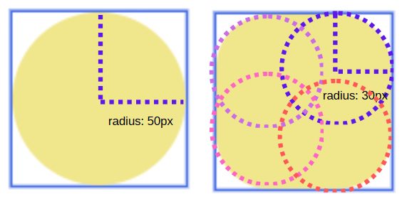
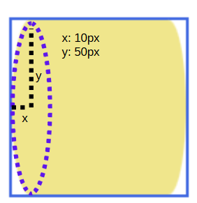
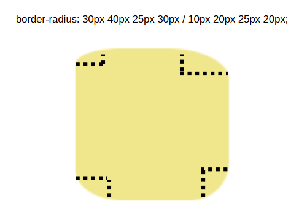
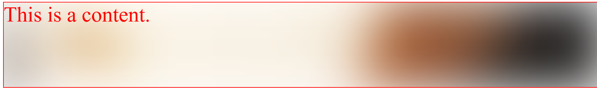

# Border Radius, Box Shadow, Text Shadow & CSS Functions

## 1. Border Radius

- a shorthand property that is used to round the corners of the element border.

### a. Circle Corners



### b. Ellipse Corners

- ellipse has major axis and minor axis.
- `border-radius: x / y;` where x is the horizontal radius and y is vertical.




### Values:

> Behaviour when overlapping radii happens: https://drafts.csswg.org/css-backgrounds/#corner-overlap

Cirle:

1. one value: `border-radius: 50px;`
- for all four corners.
1. two values: `border-radius: 25px 50px;`
- v1: top-left & bottom-right
- v2: top-right & bottom-left;
1. three values: `border-radius: 20px 50px 30px;`
- v1: top-left
- v2: top-right & bottom-left
- v3: bottom-right
1. four values: `border-radius: 10px 20px 30px 40px;`
- v1: top-left
- v2: top-right
- v3: bottom-right
- v4: bottom-left

Ellipse:
> each value in ellipse is written in the form of x / y.
> > - x: horizontal radius
> > - y: vertical radius

> refers to circle to understand what each value represents.
1. one value: `border-radius: 25px / 50px;`
2. two values: `border-radius: 25px 30px / 20px 40px;`
3. three values: `border-radius: 25px 40px 20px / 30px 20px 10px;`
4. four values: `border-radius: 10px 20px 30px 40px / 40px 30px 20px 10px;`




**absolute value (px)**
> refers to the radius of circle.

**Percentage (%)**
> refers to the radii of ellipse, regardless you write it as `single percentage value` or `x / y format`.
> You should consider the horizontal and vertical radius of the ellipse.
> visible size = size (width / height) + padding + border
- relative to the visible size (width / height) of the current element.
- `horizontal radius = (width + padding + border) * percentage`
- `vertical radius = (height + padding + border) * percentage`

```css
border-radius: 20%;
border-radius: 50% / 100%; /* x / y format */
```

**Drawing Circle**
- an element is a square where width and height is the same.
- border-radius is half the size.
- horizontal & vertical radius are the same.
```css
/* let say width: 50px; height 50px */

/* Note: value > 50% is the same as 50%. */
/*  */
border-radius: 50%; 
/* OR */
border-radius: 25px; /* radius = 50px / 2 */

```

**Drawing Semi-Circle**

```css
.box {
    width: 200px;
    height: 100px;
    background-color: tomato;
    /* Note: This code might not works as expected. */
    /* Reason: % will look for horizontal & vertical radius! */
    /* border-radius: 50% 50% 0 0; */

    /*
    horizontal radius: 200 * 50% = 100px
    vertical radius: 100 * 50% = 50px

    So, we must make sure the vertical radius is the same as horizontal radius
    We use 100% for vertical radius instead.
    */
    border-radius: 50% 50% 0 0 / 100% 100% 0 0;
}
```

**Individual Properties**
> used to override specific corners.
> based on cascading.
- `border-top-left-radius`
- `border-top-right-radius`
- `border-bottom-left-radius`
- `border-bottom-right-radius`

## 2. Box Shadow

`box-shadow: [inset] <length> [spread] <color>`

- [] means optional.
- inset: when specified, it becomes inner box-shadow.
- `<length>`: accepts two to four values.
  - `offset-x`: 
    - +ve: to the right
    - -ve: to the left.
  - `offset-y`:
    - +ve: to the top
    - -ve: to the bottom.
  - `blur-radius`: >=0
  - `spread-radius`: 
    - default: 0 (same size as element)
    - `> 0`: expand
    - `< 0`: shrink
- `<color>`: color of shadow


> we can set multiple shadow on `box-shadow` property by separate each set of values by a comma `,`.
> the first specified value will be on the top.
> when inset is set, inner box-shadow is below the content, above the background.
> the inner box-shadow will always be on top of the outer box-shadow, regardless of where it is written.

**Remove box-shadow**
```css
box-shadow: none;
```

## 3. Text Shadow

`text-shadow: <length> color`

- `<length>`
  - `offset-x`
  - `offset-y`
  - `blur-radius`
- `color`

> quite similar to box shadow.
> do not have inset, and spread.
> seldom use.

## 4. Text Overflow

> single line text overflow

```css
p {
    /* 
        an example of Defensive programming: prevent text overflow and do not affect layout.
    */

    /* Text do not wrap */
    white-space: nowrap;
    /* Show ellipsis (...) when text overflow. */
    text-overflow: ellipsis; 
    /* Hide overflow */
    overflow: hidden; 
}

```


> multiline text overflow
> - only work properly when the element height = line-height * -webkit-line-clamp(specified line number)
```css
 div {
    width: 200px;

    /* 
        Height of div = line-height * -webkit-line-clamp to work properly.
    */
    height: 60px; /* Height of two lines */
    line-height: 30px; /* Each line is 30px high */
    border: 1px solid red;
    text-overflow: ellipsis;
    overflow: hidden;

    line-clamp: 2; /* For compatibility */
    -webkit-line-clamp: 2; /* Limit the text to 2 before truncating it. */
    display: -webkit-box; /* Old webkit-based flexbox. */
    -webkit-box-orient: vertical; /* set layout to be vertical. */
}
```


## 5. Opacity

- range: 0 - 1.
- 0: transparent.
- 1: opaque (not transparent)
- outside of the range, the value will be set to the nearest range limit.

> The content / children of the element with opacity set < 1 will become transparent too.
> appear invisible when opacity = 0 but it is still part of the dom and occupy the space.
> create a new stacking context.

**Set background transparency:**

> - `background-color: rgba(r, g, b, alpha)`

**Comparison between `visibility:hidden`, `display: none`, `background-color: rgba(0,0,0,0.1)`, `opacity:0`, `overflow: hidden`**

| Property                            | Description                                                                                   |
| ----------------------------------- | --------------------------------------------------------------------------------------------- |
| `visibility: hidden`                | hide element, it is still part of DOM                                                         |
| `display: none`                     | hide element, the element will free the space it occupied before and will not be part of DOM. |
| `background-color: rgba(0,0,0,0.1)` | only makes the background transparent, will not affect content of the element.                |
| `opacity: 0`                        | element becomes transparent, including its content and children.                              |
| `overflow: hidden`                  | hide the overflow part of the element, it only affects the child elements.                    |

## 6. Filter

**blur()**
`filter: blur()` applies a Gaussian blur to the input image.

> - filter: blur() creates a new stacking context.
> - filter: blur() effect might overflow.
> - use overflow: hidden on parent to hide the overflow.



```html
<style>
.bg {
  width: 100%;
  height: 100%;
  /* background-color: royalblue; */
  background: url("./profile.jpg") no-repeat center;
  background-size: 150%; /* Increase background-image width */

  /* filter value other than none creates a new stackingcontext. */
  /* It will somehow cover the content. */
  filter: blur(60px); /* Blur the background imag*/
}
</style>

<div class="banner">
  <!-- content is absolutely positioned relative to banner. -->
  <!-- Remember to raise z-index. -->
  <!-- Reason: absolute positioned element is out of document flow.  -->
  <!-- The filter that creates a stacking context will cover the element. -->
  <!-- By raising z-index on absolute-positioned element, it creates a new stacking context, and it will be placed in higher stacking order. -->
  <div class="content"></div>
  <!-- Note: The reason to use another div for bg is to hide the spreading effect due to filter: blur. -->
  <!-- By setting overflow hidden on the parent. -->
  <div class="bg"></div>
</div>
```

**grayscale()**

```css
html {
  /* All element in html becomes gray. */
  filter: grayscale(100%); /* Standard CSS property */

  /* For browser compatibility, especially older browser version*/
  -webkit-filter: grayscale(100%); /* Webkit browser e.g., Chrome & Safari */
  -moz-filter: grayscale(100%); /* Mozilla Firefox */
  -ms-filter: grayscale(100%); /* IE */
  -o-filter: grayscale(100%); /* Opera */
}

```

## 7. Object-fit

> replaced element: https://developer.mozilla.org/en-US/docs/Glossary/Replaced_elements

- how the content of a replaced element (img, video, etc.) should be resized to fit its container.

| Property       | Description                                                                                      |
| -------------- | ------------------------------------------------------------------------------------------------ |
| contain        | scale to maintain its aspect ratio while fitting within the element's content box.               |
| cover          | fill the entire content box while maintaining aspect ratio. The object might be clipped.         |
| fill (initial) | fill the content box. if the aspect ratio not match, it will cause the object to stretch to fit. |
| none           | no resized                                                                                       |
| scale-down     | similar to either none or contain, whichever would result in a smaller size                      |

> unlike background-image that starts at the top left corner, img of image element starts at center. 

**Case: Prevent Img Distortion**

> we might assume user upload profile picture in a 1:1 ratio.
> In reality, the uploaded images come in various aspect ratios.
> This causes the images to be stretched or distorted.

```css
object-fit: cover;
```

## 8. Disable Resize

`resize`: set if an element is resizable and in what direction (vertical / horizontal).

e.g., textarea

```css
resize: none;

```
## 9. calc()

- perform calculation
- support +-*/ and follow arithmetic operation precedence.
- can work with unit px, em, rem, etc.

> leave spaces around the operator (+-*/)
> */ can work without those spaces, but it is recommended to add.

```css
width: calc(100px * 2);
```
## 10. Root Pseudo Class Selector (`:root`)

> - select html root element.
> - difference compared to html element selector: :root has higher specificity.

```css
/* 0, 1, 0 */
:root {
  background-color: red;
}

/* 0, 0, 1 */
html {
  background-color: blue;
}

```

## 11. var()

> custom properties: https://developer.mozilla.org/en-US/docs/Web/CSS/CSS_cascading_variables/Using_CSS_custom_properties


- insert custom property (aka. CSS variable).
- useful if a value is using multiple times across various places.
  

> custom properties begins with `--` e.g., `--color`
> use custom properties inside var, it will look for the nearest ancestor that has a defined value for that property, if it is not found, it will continue until it reaches the root element (html / :root).

```html
<style>
  :root {
  --font-red: red;
  --font-size: 40px;
}

.box {
  --font-color: blue;
  --bg-color: khaki;
}

.item {
  --bg-color: #000;
  color: var(--font-color); /* green - from inline style */
  font-size: var(--font-size); /* 40px */
  background-color: var(--bg-color); /* #000 */
}
</style>

<div class="box" style="--font-color: green">
  <div class="item">
    use custom property in var() and it will look for thnearest ancestor
    that has a defined value for that property.
  </div>
</div>
```

**use case:**
> change theme colors by changing the custom properties values.