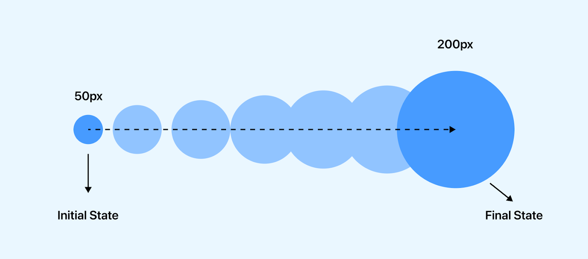
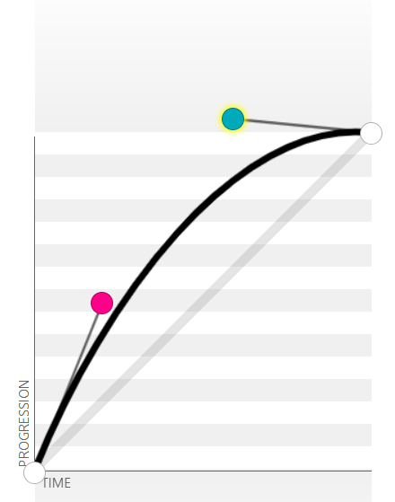
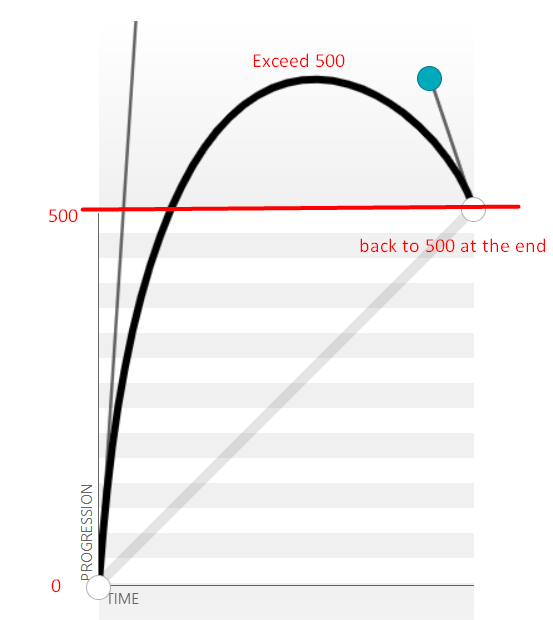
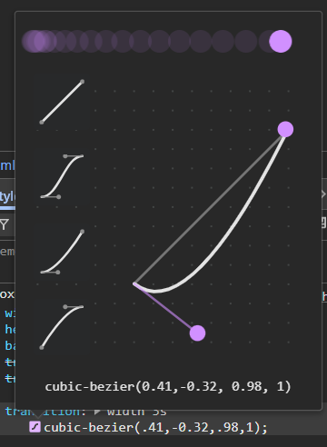

# Transition



> An element transitions by interpolating values between state A and state B over time, creating a smooth effect like having tween frames in between.

> In the past, effects are implemented using Js timer.
> It has gradually shifted to using CSS Transitioning.
> - benefit:
> > - smoother animation
> > - low memory usage
> 
> - better compatibility  

## 1.1 Syntax

**Shorthand:**
```css
transition: transition-property transition-duration [transition-timing-function] [transition-delay]
```
| Property                   | Description                                                                           |
| -------------------------- | ------------------------------------------------------------------------------------- |
| transition-property        | CSS Property Name                                                                     |
| transition-duration        | Duration / length of time a transition should take to complete (second / millisecond) |
| transition-timing-function | how intermediate values are calculated. Represent the rate of change.                 |
| transition-delay           | duration to wait before starting the transition.                                      |

```css
transition: border-radius 1s linear 0s
```

> When do transition happen?
> - when a specific property value happens to change.
> - e.g., in the example, we works with pseudo class like :hover to change the border-radius of an element.

## 1.2 Animatable CSS Properties

> all properties with numeric value can be transitioned.
> box: `width`, `height`, `border-radius`, etc.
> position: `left`, `top`, etc.
> font-related properties e.g., `font-size`, etc.
> `opacity`
> `background-color`
> `transform`

**Properties that cannot be transitioned:**
> No make sense to transition.
> - `float` & `position`
> - `display`
> - `font-family`
> - etc.

## 1.3 `all`

> all animatable properties involve in transition.
> use only for learning purpose.
> simply use in project causes performance issue. -> specify the property name based on your need.

## 1.4 Define Multiple Transitions

> separate each transition with a comma (`,`)

```css

transition: propert1 duration timing-function delay, property2 duration timing-function delay, property3 duration timing-function delay

```

## 1.5 Longhand Properties

| Property                   | Description                                                                           |
| -------------------------- | ------------------------------------------------------------------------------------- |
| transition-property        | CSS Property Name                                                                     |
| transition-duration        | Duration / length of time a transition should take to complete (second / millisecond) |
| transition-timing-function | how intermediate values are calculated. Represent the rate of change.                 |
| transition-delay           | duration to wait before starting the transition.                                      |


> - multiple values separated by commas. 
> > - Important: If there's no corresponding value, use the first value.

```css
transition-property: width, height;
transition-duration: 1s; /* as height doesn't have a transition-duration specified, it will use the first value which is 1s. */
transition-timing-function: linear, ease-in;
transition-delay: 0s, 1s;
```

> - can override shorthand properties if declared later due to CSS cascading rule.

```css
transition: width 1s;
transition-duration: 3s; /* Due to cascading rule in CSS, the longhand property declared later will override the value you specified early in shorthand property. */

```

## 1.6 Timing Functions

`transition-timing-function`

| Value                       | Description                                                                                                     |
| --------------------------- | --------------------------------------------------------------------------------------------------------------- |
| `linear`                    | transition at an even speed. Equal to cubic-bezier(0.0, 0.0, 1.0, 1.0)                                          |
| `ease` (default)            | increase velocity towards the middle, slowing back down at the end. Equal to cubic-bezier(0.25, 0.1, 0.25, 1.0) |
| `ease-in`                   | start off slowly, then increasing until the end. Equal to cubic-bezier(0.42, 0, 1.0, 1.0)                       |
| `ease-out`                  | start off quickly, then decreasing velocity until the end. Equal to cubic-bezier(0, 0, 0.58, 1.0)               |
| `ease-in-out`               | start off slowly, speeds up, and then slows down again. Equal to cubic-bezier(0.42, 0, 0.58, 1.0)               |
| `cubic-bezier(p1,p2,p3,p4)` | customize own cubic-bezier curve, p1 and p3 must be ranged between 0 - 1.                                       |


**Cubic Bezier Curve**
> Cubic Bezier: https://cubic-bezier.com/#.17,.67,.83,.67


> - x-axis: time
> - y-axis: progression


> When the curve surpasses the final value before settling back to it, it will exceeds the final value before returning to the final state.

> note: it is best not to go too far below the initial state value or exceed the final state value too much, as it will cause unexpected results.
> e.g., if the curve dips below its initial state (e.g., width) in the middle of the curve, the width might shrink too much, leaving where your curve is currently pointing, causing the hover state to be lost, and when it returns to its original size, the cursor might trigger hover state again, causing the transition repeatedly.

> we can use dev tool to test out the cubic-bezier curve.

