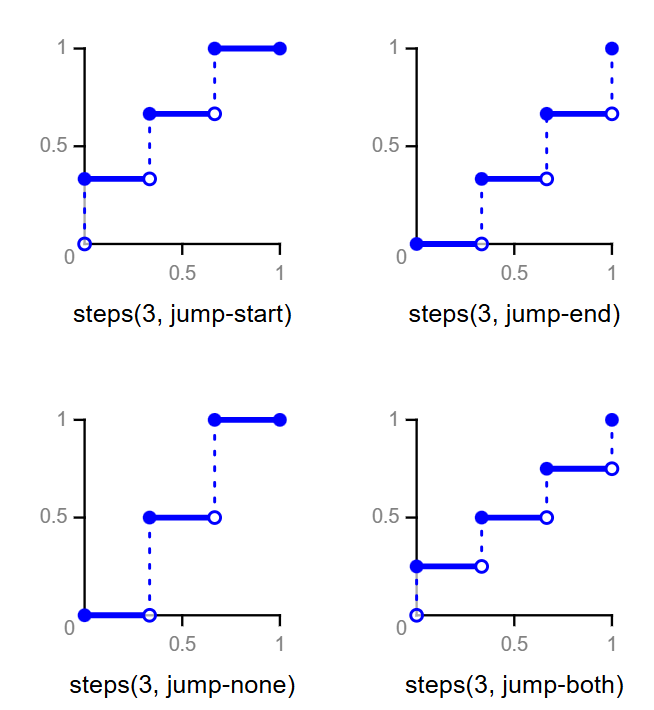
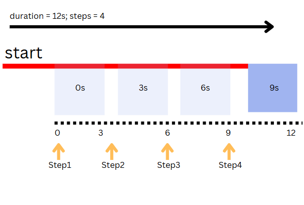
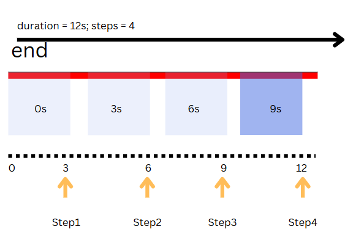

# Animation

- Step 1: define the animation.
- Step 2: apply the animation.

## 1.1 Define Animation

> use @keyframes at-rule
> - creating an animation is fundamentally about gradually changing one set of styles into another.
> - you can change the styles as you wish during the animation duration.
> - each keyframe can be defined using percentages or keywords `from` and `to` to specify when changes occur.
> - `from` and `to` is equivalent to `0%` and `100%`, representing the `start` and `end` of animation duration.
```js

/* 

    @keyframes to define animation.

*/
@keyframes animationName {
    from { /* styles*/}
    to {/* styles*/}
}

@keyframes animationName {
    0% {/* styles*/}
    100% {/* styles*/}
}

@keyframes animationName {
    0% {/* styles*/}
    25% {/* styles */}
    50% {/* styles */}
    75% {/* styles */}
    100% {/* styles*/}
}

```

## 1.2 Apply Animation

`animation: animation-name animation-duration [timing-function] [animation-delay]`

```css
animation: animationName 2s;

```

## 1.3 Setting Multiple Keyframes

> - use percentage to define keyframes in @keyframes.
> - instead of just 0% and 100%, you can specify many other intermediate keyframes too.

```css
@keyframes animationName {
    0% { /* styles */ }

    50% { /* styles */ }

    100% { /* styles */ }
}


/* Example: */
@keyframes changeBox {
    0% {
      width: 200px;
      height: 200px;
    }
    50% {
      width: 400px;
      height: 400px;
    }
    100% {
      width: 200px;
      height: 200px;
    }
}
```
> **Precautions**
> - 1. if you didn't specify 0% and 100%, the styles at 0% and 100% will be default to the element's initial state.

```css
 @keyframes changeBox {
    
    /* 
        0% & 100% will use the initial state value of the styles.
    */

    50% {
      width: 400px;
      height: 400px;
    }
    
      }
```


> - 2. When you specify a style in an earlier keyframe, but not in a later one, the later keyframe will be using the initial state value of the style.


```css
@keyframes changeBox {
    0% {
        width: 100px;
        height: 100px;
    }
    50% {
        width: 200px;
        height: 100px;
    }
    /* width is not specified in 100%, it will revert to the initial state which is 100px.  */
    100% {height: 200px;}
}
```
## 1.4 Animation Shorthand

`animation: animation-name animation-duration animation-timing-function animation-delay animation-iteration-count animation-direction animation-fill-mode animation-play-state`

| Property                  | Description                                                                   |
| ------------------------- | ----------------------------------------------------------------------------- |
| animation-name            | specify keyframe name to select the keyframe at-rule                          |
| animation-duration        | time taken to finish an animation cycle. unit: s / ms                         |
| animation-timing-function | how animation will progress between each pair of key frames.                  |
| animation-delay           | specify when the animation will start.                                        |
| animation-iteration-count | number of times an animation cycle is played. initial = 1 (play once).        |
| animation-direction       | specify whether the animation will play in reverse in some / all cycle.       |
| animation-fill-mode       | specify how CSS applies styles to the element before and after the animation. |
| animation-play-state      | specify whether an animation is running or paused.                            |


**Setting more than one animations:**
 
`animation: move 2s, bgColor 2s 2s forwards, ...`

> - use comma to separate each set of animation.

## 1.5 Animation Longhand Properties

### 1.5.1 `animation-iteration-count`
- values:
  - n: play n times.
  - infinite: play forever.

### 1.5.2 `animation-direction`
- values: 
    - normal (default)
    - reverse: play in reverse.
    - alternate: odd -> normal, even -> reverse
    - alternate-reverse: odd -> reverse, even -> normal

> usually, use alternate. Animation starts from initial state to end state, and then from end state, back to initial state.

### 1.5.3 `animation-fill-mode`
- value:
    - normal (default): do not apply style of keyframe to the element before and after the animation.
    - forwards: applying the last keyframe style to the element when the animation ends.
    - backwards: applying the first keyframe style to the element when the animation starts.
    - both: combine both forwards and backwards.

> example, when you show an animation, but the last frame shows up an image, and you want the img to keep at where it is at the end of animation wihout letting the img to return to its initial state. use forwards.

### 1.5.4 `animation-play-state`

- value:
  - paused: stop animation.
  - running: resume animation. (initial / default)

> example: work with hover state to pause animation when you move your cursor on top of an element.

>**Note:**
> when resuming animation, it will start from where it left off at the time it was paused.

### 1.5.5 `animation-timing-function` - `steps()`
- creates a step-based animation where each iteration is divided into nth equal length of stops.

```css
@keyframes move {
    0% {}
    100% {}
}

```

> `step(n, step-position)`
> - n : integer, number of stops / steps.
> - step-position: 
>   - `start`: the change happens at the beginning of each interval. (run immediately)
>   - `end`: the change happens at the end of each interval. (wait first and run)
> **extra:**
>   - `jump-both`: step + 1 (adds an extra step at both 0% and 100%)
>   - `jump-none`: step - 1 (remove step at both 0% and 100%)

> step => sudden change in value

| Step Position | Step at 0% | Step at 100% | Number of Jump |
| ------------- | ---------- | ------------ | -------------- |
| `start`       | ✅          | ❌            | `n`            |
| `end`         | ❌          | ✅            | `n`            |
| `jump-both`   | ✅          | ✅            | `n+1`          |
| `jump-none`   | ❌          | ❌            | `n-1`          |



**Visualization:**
> step: 4 duration: 12s
> **start:** 
> - start at 0%.
> - every step happens at 0s, 3s, 6s, 9s -> the beginning of each interval.
> - since the last step happens at 9s before the animation ends (12s), the element is already in its final state.


> **end:** execute the first keyframe at 3s.
> - every step happens at 3s, 6s, 9s, 12s.
> - since 'end' means stepping at the end of each interval, the final step happens exactly at 12s (the end of animation duration).
> - the last step is executed, but because the animation finishes immediately after, the effect is never visible because the browser immediately reset the element to its original state in the next frame.
> solution: keep the last step visible: `animation-fill-mode: forwards`.


### 1.5.5.1 Notes on Steps

> `steps` is applied in each keyframe interval, not the entire animation. 
> Each interval has its own step-based progression.


### 1.6 Difference between Transition & Animation

1. Transition requires specifying the initial and final state, animation requires working with keyframes specified by @keyframes.
2. Transition requires working with CSS pseudo classes like hover / JS to trigger. Animation works with @keyframes allows the animation to play when entering the page.
3. Animation has different properties e.g., iteration count, fill mode, direction, play-state etc that can control the number of animation cycles, but transition can only be triggered once, and lack the control.
4. Animation can set styles on multiple keyframes, while transition only has two keyframes (initial and final)


### 1.7 Animate.css Library

> https://animate.style/