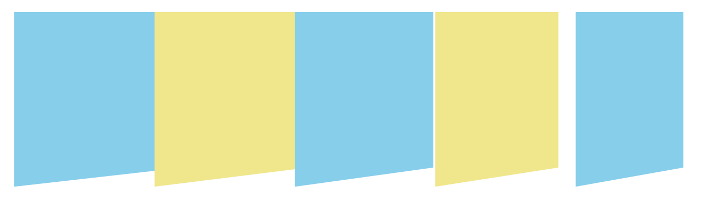
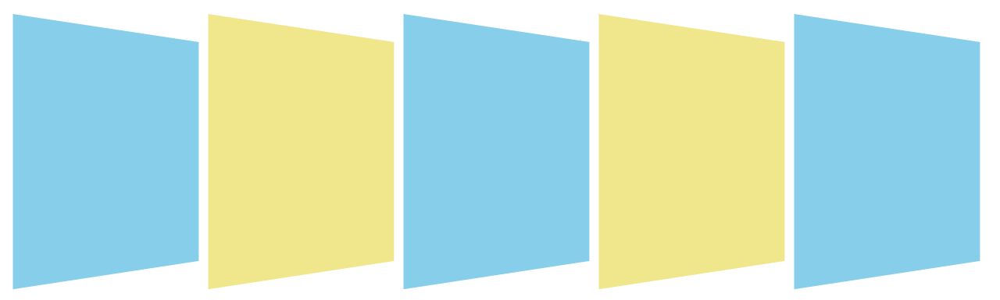

# Transform
[toc]
## 1.1 Transform Property

> value can be `none`, one or more `CSS Transform Functions`.
> when tranform is set to values other than none, the element will create a stacking context. 

### 1.1.1 2D Transform Functions

| Value             |
| ----------------- |
| `translate(x, y)` |
| `translateX(x)`   |
| `translateY(y)`   |
| `rotate(ax)`      |
| `scaleX(x)`       |
| `scaleY(y)`       |
| `scale(x, y)`     |
| `skew(ax, ay)`    |
| `skewX(ax)`       |
| `skewY(ay)`       |

### 1.1.2 3D Transform Functions

| Value                  |
| ---------------------- |
| `translateZ(z)`        |
| `translate3d(x, y, z)` |
| `rotateX(ax)`          |
| `rotateY(ay)`          |
| `rotateZ(az)`          |


## 1.2 2D Transform

> top left corner of the element is (0, 0)

**Precaution:**
> - When writing transform, you must put each transform function in a row separated by a space.
> - When you do something like the following, the latter one will override the previous one.
> In transform, those transform functions are just values, not properties, so we cannot simply treat them as property and hope they will override the previous value!
```css

/* Do not do this! The latter one will override the previous one! */
transform: translateX(-50px);
transform: translateY(-50px);

/* Do this instead: */
transform: translateX(-50px) translateY(-50px);
```

### 1.2.1 Translate

> reposition element in the horizontal or vertical direction.

| Value                  | Description                                                                |
| ---------------------- | -------------------------------------------------------------------------- |
| translate(x,y)         | control the position of element in both horizontal and vertical direction. |
| translatehorizontal(x) | control the position of element in horizontal direction.                   |
| translateY(y)          | control the position of element in vertical direction.                     |

#### 1.2.1.1 translate(x, y)

- unit: px / %
- value: 
  - +ve means move right or down.
  - -ve means move left or top.
- similar to `position: relative;`, its original space remains intact.
- it moves the element visually without affecting other elements.

**Percentage (%)**

```css
transform: translate(x%, y%);

```
> - relative to element own's visible size.
> - x: (width + left-right-padding + left-right-border) * x%
> - y: (height + top-bottom-padding + top-bottom-border) * y%

**When y is not specified:**
> - y is default to 0. 
```css
transform: translate(x); // equivalent to transform: translate(x, 0);
```

**Centering:**
> work with absolute-positioned element to center an element both horizontally and vertically.
> Benefits:
> - when you don't know the height of the element because you want to height grows based on content.
> - the calculation including padding and border is done automatically for you.
```css
position: absolute;
top: 50%;
left: 50%;
transform: translate(-50%, -50%);
```

> Note: Centering can also be done by negative margin.
> Drawback:
> 1. You need to manually calculate the appropriate size including the padding and border in px yourself.
> 2. When the height of an element is not specified, margin will not work!

#### 1.2.1.2 translateX(x)

- reposition in x direction.

#### 1.2.1.3 translateY(y)

- reposition in y direction.


### 1.2.2 Scale

#### 1.2.2.1 scale(x, y) 

- x and y represent scaling factor.
- unit: number / %
- value > 1: scale up / enlarge
- value < 1: scale down / shrink
- value = 1: remain unchanged.
- if y is not specified, y is default to x value.

> resulting visible width = width + left-right padding + left-right border * x %
> resulting visible height = height + top-bottom padding + top-bottom border * y%
> note: this is just another way of writing, it is the same as using number.
```css
transform: scale(x%, y%);
transform: scale(x, y);
/* Both are same, including border, padding in calculation. */
```
#### 1.2.2.2 scaleX(x)
- control the scaling of the element's visible width (width + padding + border).
#### 1.2.2.3 scaleY(y)
- control the scaling of the element's visble height (height + padding + border).

### 1.2.3 Skew

> apply skew / shear transformation to an element, making it appear slanted.

unit: deg (angle)

#### 1.2.3.1 skew(ax, ay)
- control the skew at both x and y axis.
#### 1.2.3.2 skewX(ax)
- control the skew along x-axis (horizontal slant).

> skewX(+ve):  
> - the top remains in place.
> - push the bottom of the element to the right.
> skewX(-ve): 
> - the bottom remains in place.
> - push the top of the element to the right.

#### 1.2.3.3 skewY(ay)
- control the skew along y-axis (vertical slant).

> skewY(+ve): 
> - the left side remains in place.
> - push the right side of the element down.
> skewY(-ve): 
> - the right side remains in place.
> - push the left side of the element down.

### 1.2.4 Rotate

- unit: angle
- +ve: clockwise
- -ve: anti-clockwise

```css
transform: rotate(angle);
```

### 1.2.5 transform-origin

> use to set the origin for an element's transformations.
> x & y value can be `<length>` value like px or % or preset keywords.
> z value can only be `<length>` value.

> use for rotate, skew, scale.

```css
/* 2D */
transform-origin: x y;

/* 3D */
transform-origin: x y z;
```

#### 1.2.5.1 Keywords

| keyword      | description            |
| ------------ | ---------------------- |
| left         | left center            |
| right        | right center           |
| top          | top center             |
| bottom       | bottom center          |
| center       | center center          |
| left top     | top left corner (0, 0) |
| right top    | top right corner       |
| left bottom  | bottom left corner     |
| right bottom | bottom right corner    |

> Default value: `transform-origin: center`

#### 1.2.5.2 Values

- unit: px or %
- when y is not specified, it is default to center (vertical center).

**Percentage**
> relative to element own visible size (width / height).

### 1.2.6 Writing Order

> The order of how you write the transform function matters.
> e.g., rotate first will cause the direction of axis to change.

```css
transform: translate() rotate() scale();

```

> MDN:
> - The transform functions are multiplied left to right, meaning that they are applied in **right to left** order.

> Chaining Transform: https://codepen.io/bali_balo/post/chaining-transforms
> - this article mentioned about two ways of looking at the chained transformation.
> - Both`left to right` or `right to left` interpretations are correct.
> - `Left to right interpretation`: the system of coordinate will be changed. 
>   - e.g., translate after rotate: the system of coordinate also rotate, meaning the x and y axes are rotated, and then the element is translated based on the new axis direction.
> - `Right to left interpretation`: follow mathematical computation order, the coordinate system is fixed.
>   - e.g., `transform: translate() scale() rotate()` means the element rotate first, then scale, and lastly apply translate.  

> Tip:
> - think where the transform ends up to be, before you write the transform functions.

## 1.3 3D Transform

- 3D:


### 1.3.1 Perspective

> 1. Large perspectives causes less transformation.
> 2. Small perspectives causes small transformation.

> **Analogy**:
> - Case 1: put a phone very close to your eye.
>   - moving it towards or away from your eyes you will see a very obvious change in size.
> - Case 2: put a phone very far away from your eye.
>   - moving it towards or away from your eyes the change in size is not that obvious.

### 1.3.2 3D Translate

#### 1.3.2.1 translateZ(z)

> must work with `perspective`.
> example, perspective = 300px;
> translateZ < 0; => element becomes smaller.
> translateZ = 0; => element remains unchanged. 
> 0 < translateZ < 300; => element becomes larger.
> translateZ >= 300; => as if the element is side by side with you or at the back of you, it is invisible.

#### 1.3.2.2 translate3d(x, y, z)
> the value of z can't be percentage!

### 1.3.3 3D Rotate

- rotateX(ax)
- rotateY(ay)
- rotateZ(az)

> use left hand grip rule.
> - your thumb will be the direction of axis.
> - the other four fingers is the direction of rotation.

> note:
> +ve x-axis: right
> +ve y-axis: bottom
> +ve z-axis: toward user / perpendicular to the screen

### 1.3.4 Transform Style

> `transform-style` specify whether the children of an element are positioned in 3D space, or flattened in the plane of the element.
> values:
> - flat: flatten in 2d plane.
> - preserve-3d: make the children positioned in 3D space.

### 1.3.5 Transform Origin

> `transform-origin: x y z;`
> default: `transform-origin: 50% 50% 0px;`
```css


transform-origin: x y; /* similar to transform-orgin: x y 0 */

transform-origin: x y z;
```

> x and y unit can be both <length> or percentage.
> z unit can only be <length>.

### 1.3.6 The Effect of Perspective on Children



> when a parent has a `perspective` property set and we apply 3D transformation on each child, its children will appear larger to smaller from left to right. Besides, the gap between the element will also increase from left to right.
> **application**: 



> To create an effect where each child appear visually similar, we must set perspective on each child.
> Add div in each child.
> and rotate the div in each child.


